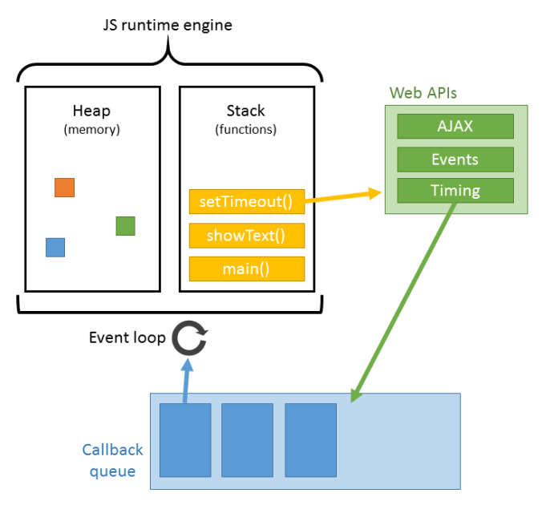

# JavaScript与执行栈

学习和使用JavaScript这门语言眼看着也有了两年时光，一直以来对于JavaScript的运行机制不甚了解，  
一方面是自己对于语言底层的东西很感兴趣（作为一个非计算机专业同学的坚持），另一方面，这些知识也给开发带来更多的助力（虽然表面上看上去没怎么用到。）

## 一切从执行栈开始

关于执行栈，这其实并不是JavaScript专有的知识 ，计算机语言的执行几乎都是依赖于执行栈的。

> 执行栈是计算机科学中存储有关正在运行的子程序的消息的栈。经常被用于存放子程序的返回地址。在调用任何子程序时，主程序都必须暂存子程序运行完毕后应该返回到的地址。因此，如果被调用的子程序还要调用其他的子程序，其自身的返回地址就必须存入执行栈，在其自身运行完毕后再行取回。在递归程序中，每一层次递归都必须在执行栈上增加一条地址，因此如果程序出现无限递归（或仅仅是过多的递归层次），执行栈就会产生栈溢出。

关于执行栈的称呼或者说别名有很多种：
* 执行栈（Execution stack）
* 调用栈（Call stack）
* 控制栈（Control stack）
* 运行时栈（Run-time stack）
* 机器栈（Machine stack）

以上名词所要表达的都是一个意思，下文中指定使用 **执行栈** 表达

JavaScript执行栈示意图  

### **功能**

调用栈的主要功能是存放返回地址。除此之外，调用栈还用于存放：
* 本地变量：子程序的变量可以存入调用栈，这样可以达到不同子程序间变量分离开的作用。
* 参数传递：如果寄存器不足以容纳子程序的参数，可以在调用栈上存入参数。
* 环境传递：有些语言（如Pascal与Ada）支持“多层子程序”，即子程序中可以利用主程序的本地变量。这些变量可以通过调用栈传入子程序。

## JavaScript执行上下文、函数堆栈、提升的概念

首先明确几个概念：
* `EC`：函数执行环境（或执行上下文），Execution Context
* `ECS`：执行环境栈，Execution Context Stack
* `VO`：变量对象，Variable Object
* `AO`：活动对象，Active Object
* `scope chain`：作用域链