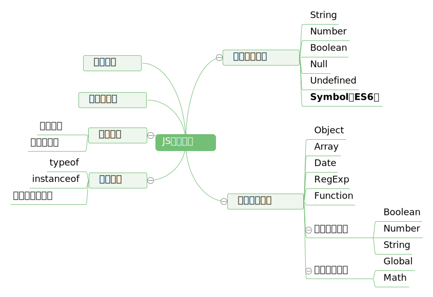
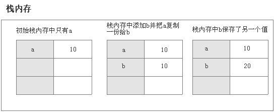

# JavaScript基础之变量类型

## JavaScript变量类型思维导图



## 概述

> ECMAScript包括两个不同类型的值：基本数据类型和引用数据类型。
> 基本数据类型指的是简单的数据段，引用数据类型指的是有多个值构成的对象。
> 当我们把变量赋值给一个变量时，解析器首先要确认的就是这个值是基本类型值还是引用类型值。
> 到目前为止，我们看到的大多数引用类型值都是Object类型的实例。  
><p align="right"> -------《JavaScript高级程序设计》</p>

## 常见的基本数据类型

<font color=#0099ff size=3 face="黑体">Number、String 、Boolean、Null和Undefined。</font>
基本数据类型是按值访问的，因为可以直接操作保存在变量中的实际值。示例：

``` js
  var a = 10
  var b = a;
  b = 20;
  console.log(a); // 10值
```

上面，b获取的是a值得一份拷贝，虽然，两个变量的值相等，但是两个变量保存了两个不同的基本数据类型值。
b只是保存了a复制的一个副本。所以，b的改变，对a没有影响。
下图演示了这种基本数据类型赋值的过程：



常见的引用类型数据
也就是对象类型Object type，比如：Object 、Array 、Function 、Data等。
　　javascript的引用数据类型是保存在堆内存中的对象。与其他语言的不同是，你不可以直接访问堆内存空间中的位置和操作堆内存空间。只能操作对象在栈内存中的引用地址。
　　所以，引用类型数据在栈内存中保存的实际上是对象在堆内存中的引用地址。通过这个引用地址可以快速查找到保存中堆内存中的对象。
　　var obj1 = new Object();
　　var obj2 = obj1;
　　obj2.name = "我有名字了";
　　console.log(obj1.name); // 我有名字了
　　说明这两个引用数据类型指向了同一个堆内存对象。obj1赋值给onj2，实际上这个堆内存对象在栈内存的引用地址复制了一份给了obj2，
　　但是实际上他们共同指向了同一个堆内存对象。实际上改变的是堆内存对象。
下面我们来演示这个引用数据类型赋值过程：

