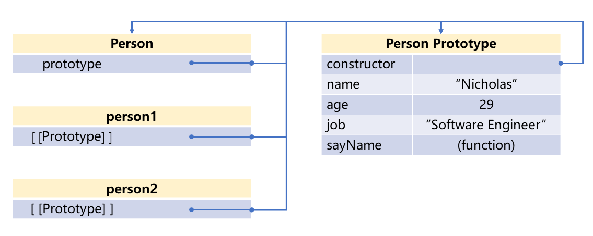
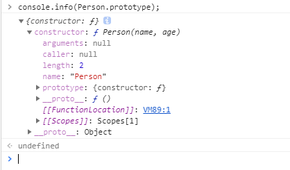
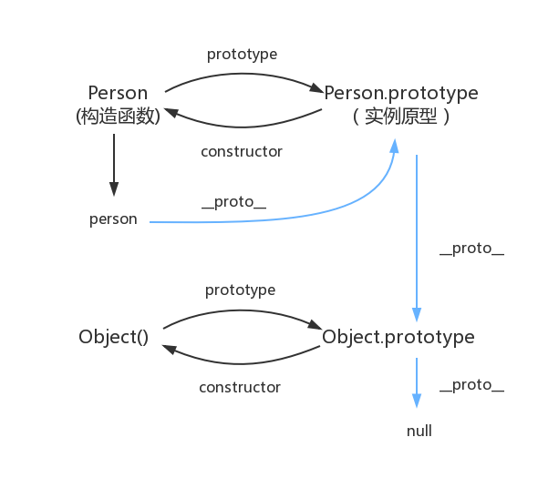
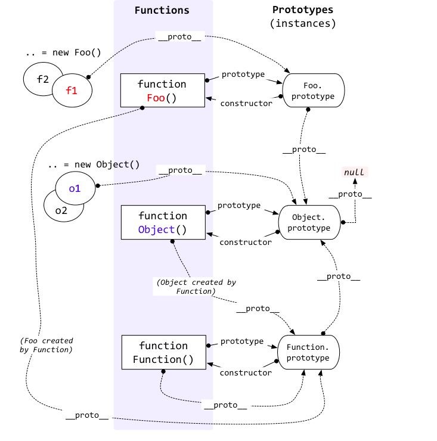

# JavaScript深度理解原型链

## 原型链知识思维导图


## 序言

为什么要有原型和原型链，因为这是JavaScript这门语言实现面向对象编程的基石之一。进一步理解，构造函数、原型和原型链是JavaScript实现继承的基础，而继承是面向对象编程重要特性。  
原型与原型链是JavaScript这门语言一个重要的特性，深刻理解非常重要。

## 什么是原型？

我们创建的每个函数都有一个 `prototype` (原型)属性，这个属性是一个指针，指向一个对象，而这个对象的用途是包含可以由特定类型的所有实例共享的属性和方法。
（每一个JavaScript对象(null除外)在创建的时候就会与之关联另一个对象，这个对象就是我们所说的原型，每一个对象都会从原型"继承"属性。
原型对象、实例原型是一回事，都是不同人的叫法不同）

## 理解原型对象、prototype属性、constructor构造函数

JavaScript中，无论什么时候，只要创建了一个新函数，就会根据一组特定的规则为该函数创建一个prototype属性，这个属性指向函数的原型对象。
在默认情况下，所有原型对象都会自动获得一个constructor（构造函数）属性，这个属性是一个指向prototype属性所在函数的指针。
构造函数、原型对象、实例之间关系图


函数的 prototype 属性指向了一个对象，这个对象正是调用该构造函数而创建的实例的原型，也就是这个例子中的 person1 和 person2 的原型。

``` js
function Person(name, age) {
  this.name = name;
  this.age = age;

  this.selfIntroduction = function () {
    console.log(this.name + " is " + this.age + " years old.", 'color:red;');
  };
}

  var person = new Person("shaogucheng", 18);
  console.info(Person.prototype);
  console.info(person);
  console.info(person.prototype);
```

控制台可以看到清晰的结构  


创建了自定义的构造函数之后，其原型对象默认只会取得constructor属性；至于其他方法，则都是从Object继承而来的。当调用构造函数创建一个新实例后，该实例的内部将包含一个指针（内部属性），指向构造函数的原型对象。ECMA-262第5版中管这个指针叫[[Prototype]]。虽然在脚本中没有标准的方式访问[[Prototype]]，但Firefox、Safari和Chrome在每个对象上都支持一个属性_proto_；而在其他实现中，这个属性对脚本则是完全不可见的。不过，要明确的真正重要的一点就是，这个连接存在于实例与构造函数的原型对象之间，而不是存在于实例与构造函数之间。

------------------

## 分步理解原型链构成

这里的Person就是构造函数本尊，它本身是对象，也是函数。关于Person的深刻理解，请参考文章。`
当Person这个函数新建之后，就会有一个属性（其实是一个指针），指向原型对象（实例原型），原型对象是客观存在的对象。

``` js
function Person(name, age) {
  this.name = name;
  this.age = age;

  this.selfIntroduction = function () {
    console.log(this.name + " is " + this.age + " years old.", 'color:red;');
  };
}

  var person = new Person("shaogucheng", 18);
  console.info(Person.prototype);
  console.info(person);
  console.info(person.prototype);
```

> 我们创建的每个函数都有一个 `prototype` (原型)属性，这个属性是一个指针，指向一个对象，而这个对象的用途是包含可以由特定类型的所有实例共享的属性和方法。 ——《JavaScript高级程序设计》

正如图中展示的那样，Person函数天生就会有一个属性，prototype，这个属性是一个指针，指向原型对象（实例原型）  
  

在控制台运行 `var person = new Person("shaogucheng", 18);` 根据构造函数new出新的对象，这个其实就是面向对象中，根据模板实例化对象的过程（Person --> person）。


> 这里要稍微介绍一下new的过程：
> 1. 创建一个新对象；
> 2. 将构造函数的作用域赋给新对象（因此this就指向了这个新对象）；
> 3. 执行构造函数中的代码（为这个新对象添加属性）；
> 4. 返回新对象。

为了更好的理解上图，我们在控制台输入 `console.info(person);` ,输出相关信息：
  
这样，无论使用代码 `console.info(Person.prototype === person.__proto__);`  结果为 `true` 还是看日志中两者的结构，都能得出的结论。实例上的 `__proto__` 属性是指向实例原型，这大概也就是为什么原型对象也叫实例原型的原因吧。


我们可以在控制台执行 `console.info(Person.prototype);` 根据打印的日志信息，可以直观看到原型对象，并且看到原型对象上的属性。在原型对象上有一个构造属性**constructor**,并且这个构造属性也是一个指针，指向构造函数本身，这样就可以得出上图中实例原型中的constructor属性指向构造函数本身的线。
  

构造函数的原型对象的原型又是谁呢？  
  

喜大普奔的是chrome浏览器支持显示 `__proto` 属性，所以在控制台输入：`console.info(Person.prototype.__proto__);` 我们就能愉快的观察到Person构造函数的原型对象的原型是谁。
  
这样，真相就已经很明显了。

  
上图就已经很明显的给出了原型链的雏形。

最后的最后我们祭出经典原型链图。
