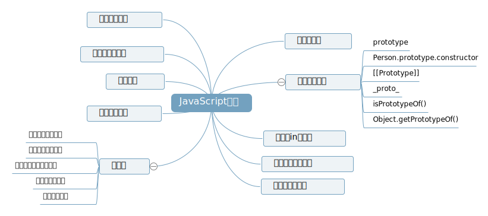
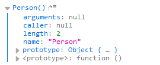
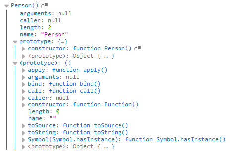

# JavaScript深度理解原型链

## 原型链知识思维导图



## 序言

为什么要有原型和原型链，因为这是JavaScript这门语言实现面向对象编程的基石之一。进一步理解，构造函数、原型和原型链是JavaScript实现继承的基础，而继承是面向对象编程重要特性。  
原型与原型链是JavaScript这门语言一个重要的特性，深刻理解非常重要。

## 什么是原型？

我们创建的每个函数都有一个 `prototype` (原型)属性，这个属性是一个指针，指向一个对象，而这个对象的用途是包含可以由特定类型的所有实例共享的属性和方法。
（每一个JavaScript对象(null除外)在创建的时候就会与之关联另一个对象，这个对象就是我们所说的原型，每一个对象都会从原型"继承"属性。
原型对象、实例原型是一回事，都是不同人的叫法不同）

## 理解原型对象、prototype属性、constructor构造函数

JavaScript中，无论什么时候，只要创建了一个新函数，就会根据一组特定的规则为该函数创建一个prototype属性，这个属性指向函数的原型对象。
在默认情况下，所有原型对象都会自动获得一个constructor（构造函数）属性，这个属性是一个指向prototype属性所在函数的指针。
构造函数、原型对象、实例之间关系图


函数的 prototype 属性指向了一个对象，这个对象正是调用该构造函数而创建的实例的原型，也就是这个例子中的 person1 和 person2 的原型。

``` js
function Person(name, age) {
  this.name = name;
  this.age = age;

  this.selfIntroduction = function () {
    console.log(this.name + " is " + this.age + " years old.", 'color:red;');
  };
}

  var person = new Person("shaogucheng", 18);
  console.info(Person.prototype);
  console.info(person);
  console.info(person.prototype);
```

控制台可以看到清晰的结构  


创建了自定义的构造函数之后，其原型对象默认只会取得constructor属性；至于其他方法，则都是从Object继承而来的。当调用构造函数创建一个新实例后，该实例的内部将包含一个指针（内部属性），指向构造函数的原型对象。ECMA-262第5版中管这个指针叫[[Prototype]]。虽然在脚本中没有标准的方式访问[[Prototype]]，但Firefox、Safari和Chrome在每个对象上都支持一个属性_proto_；而在其他实现中，这个属性对脚本则是完全不可见的。不过，要明确的真正重要的一点就是，这个连接存在于实例与构造函数的原型对象之间，而不是存在于实例与构造函数之间。

------------------

## 分步理解原型链构成

这里的Person就是构造函数本尊，它本身是对象，也是函数。关于Person的深刻理解，请参考文章。`
当Person这个函数新建之后，就会有一个属性（其实是一个指针），指向原型对象（实例原型），原型对象是客观存在的对象。

``` js
function Person(name, age) {
  this.name = name;
  this.age = age;

  this.selfIntroduction = function () {
    console.log(this.name + " is " + this.age + " years old.", 'color:red;');
  };
}

  var person = new Person("shaogucheng", 18);
  console.info(Person.prototype);
  console.info(person);
  console.info(person.prototype);
```

> 我们创建的每个函数都有一个 `prototype` (原型)属性，这个属性是一个指针，指向一个对象，而这个对象的用途是包含可以由特定类型的所有实例共享的属性和方法。 ——《JavaScript高级程序设计》

正如图中展示的那样，Person函数天生就会有一个属性，prototype，这个属性是一个指针，指向原型对象（实例原型）  
  

在控制台运行 `var person = new Person("shaogucheng", 18);` 根据构造函数new出新的对象，这个其实就是面向对象中，根据模板实例化对象的过程（Person --> person）。


> 这里要稍微介绍一下new的过程：
> 1. 创建一个新对象；
> 2. 将构造函数的作用域赋给新对象（因此this就指向了这个新对象）；
> 3. 执行构造函数中的代码（为这个新对象添加属性）；
> 4. 返回新对象。

为了更好的理解上图，我们在控制台输入 `console.info(person);` ,输出相关信息：
  
这样，无论使用代码 `console.info(Person.prototype === person.__proto__);`  结果为 `true` 还是看日志中两者的结构，都能得出的结论。实例上的 `__proto__` 属性是指向实例原型，这大概也就是为什么原型对象也叫实例原型的原因吧。


我们可以在控制台执行 `console.info(Person.prototype);` 根据打印的日志信息，可以直观看到原型对象，并且看到原型对象上的属性。在原型对象上有一个构造属性**constructor**,并且这个构造属性也是一个指针，指向构造函数本身，这样就可以得出上图中实例原型中的constructor属性指向构造函数本身的线。
  

构造函数的原型对象的原型又是谁呢？  
  

喜大普奔的是chrome浏览器支持显示 `__proto` 属性，所以在控制台输入：`console.info(Person.prototype.__proto__);` 我们就能愉快的观察到Person构造函数的原型对象的原型是谁。
  
这样，真相就已经很明显了。

  
上图就已经很明显的给出了原型链的雏形。

最后的最后我们祭出经典原型链图。


function与object是数据类型,Function与Object是两个函数对象的标识符(等价于两个函数对象),Function与Object的数据类型都是function.

首先我们看下面的例子(typeof 表示数据类型,instanceof表示实例类型---用原型链查找):

``` js
var a = function(){};
var b = {};
var c = 1;
var d;
var e = null;
var f = false;
var g = "";

console.log( typeof a);//function
console.log( a instanceof Function);//true
console.log( a instanceof Object);//true

console.log( typeof b);//object
console.log( b instanceof Function);//true
console.log( b instanceof Object);//true

console.log( typeof c);//number
console.log( c instanceof Function);//false
console.log( c instanceof Object);//false

console.log( typeof d);//undefined
console.log( d instanceof Function);//false
console.log( d instanceof Object);//false

console.log( typeof e);//object
console.log( e instanceof Function);//false
console.log( e instanceof Object);//false

console.log( typeof f);//boolean
console.log( f instanceof Function);//false
console.log( f instanceof Object);//false

console.log( typeof g);//string
console.log( g instanceof Function);//false
console.log( g instanceof Object);//false
```

javastcript中六种数据类型number,string,boolean,undefined,object,function.注意null是不属于数据类型,null只表示数据值,null的数据类型是object,由此number,string,boolean,undefined为值类型,object,function为引用类型.然后object和Object,function和Function表示的意义是不同的,小写的是数据类型,大写的是函数标识对象.数据类型为object的数据对象(除了null)外其实例类型是Object,而数据类型为function的实例类型既是Function,也是Object,原因在于Function.prototype.__proto__ == Object.prototype,所以所有的object和funtion数据类型的数据对象的实例类型都是Object.因为实例类型是按原型链查找的.
看下面的例子:

``` js
console.log(typeof Object);//function
console.log(typeof Function);//function

console.log( Object instanceof Function);//true
console.log( Function instanceof Object);//true
console.log( Object.__proto__ == Function.prototype);//true
console.log( Function.__proto__ == Function.prototype);//true
console.log( Function.prototype.__proto__ == Object.prototype);//true

关键在这一步: Function.prototype.__proto__ == Object.prototype
```

数据类型为object的数据对象,内置__proto__对象
而数据类型为function的数据对象(函数),内置__proto_外,还有scope,prototype,length等对象
关键在于object类型的只有声明创建时,而function类型的除了声明创建时,还有函数运行时
var Fn = function(){};//这是函数声明时
Fn();//这是函数运行时.

首先第一个概念：**function与object是数据类型,Function与Object是两个函数对象的标识符(等价于两个函数对象)，Function与Object的数据类型都是function。**  
其次第二个概念：**JavaScript中所有的对象都继承自Object原型，而Function又充当了对象(Object)的构造器。**  
然后第三个概念：**一切都是对象**  
这张图可能很好的看到Function和Object的内在联系。  


* `Object` 是所有对象的爸爸，所有对象都可以通过 `__proto__` 找到它
* `Function` 是所有函数的爸爸，所有函数都可以通过 `__proto__` 找到它
* 函数的 `prototype` 是一个对象
* 对象的 `__proto__` 属性指向原型， `__proto__` 将对象和原型连接起来组成了原型链

首先需要理解的是：**一切都是对象** 这句话的含义：

``` js
console.log(Object instanceof Object); // true
console.log(Function instanceof Object);// true  
console.log(Object instanceof Function);// true
console.log(Function instanceof Function);// true
```

由此可见，Object继承自己，Funtion继承自己，Object和Function互相是继承对方，也就是说Object和Function都既是函数也是对象。这一点很特别。所有的函数都是对象，可是并不是所有的对象都是函数。证明如下：

``` js
function foo(){};
console.log(foo instanceof Function); // true
console.log(foo instanceof Object); // true
console.log(new foo() instanceof Function); // false
```

我们看到由new + function的构造器实例化出来的对象不是函数，仅仅是Object的子类。接下来，我们会想所有的对象都有一个Function的构造器存储在原型链的constructor属性中，那么Object的构造器是什麽呢？ 证明：

``` js
console.log(Object.constructor); // function Function(){ [native code] }
console.log(Function.constructor); // function Function(){ [native code] }
```

由此我们可以确定Object是由Function这个函数为原型的，而Function是由它自己为原型的。Function函数是由native code构成的，我们不用去深究了。存在function Function(){...}的定义，我们明白了Function其实就是函数指针，也看作函数变量。就相当于function foo(){}中的foo。连Object的构造器都是指向Function的，可以想象Function是一个顶级的函数定义，大大的区别于自定义的如function foo(){}这样的函数定义。

看这样一个语句，new Function();以Function为原型来实例化一个对象，按照刚才Object.constructor 为 functon Function(){}来说，new Function()产生的对象应该是一个Object啊，我们来验证一下：

``` js
console.log(new Function() instanceof Object); // true
console.log(Object instanceof new Function());// false
console.log(typeof new Function());// function
console.log(typeof Object);// function
```

其实new Function();将产生一个匿名函数，由于Function是顶级函数所以可以产生自定义函数，我们可以把所有的函数看作Function的子类。但所有的一切包括函数都是Object的子类这点是不变的，也得到了体现。typeof Object的结果说明Object也是一个函数。继续做实验：

``` js
alert(new Object().constructor); // function Object(){ [native code] }
```

一个情理之中的疑惑。可以这么说凡是可以放在new后面的都是一个函数构造器，那么Object确实也像其它函数一样，是一个函数的指针或者是函数变量，但Function是顶级的所以Object要由Function来构造。可以这么理解，Function和Object一个是上帝，一个是撒旦同时诞生于宇宙的最开始，拥相当的力量。但是上帝更为光明，所以高高在上。Object要由Function来构造，Function属于顶级函数。但是撒旦并没有绝对的输给上帝，否则上帝就会消灭撒旦。于是或所有的对象都要继承Object包括Function(Object和Function既是对象又是函数)。就相当于所有的人包括上帝都有邪念一样。

拓展一下，由Object我们会想到Array,Number,String等这些内置对象。有理由相信这些都是Object的子类。如下：

``` js
console.log(Array instanceof Object) // true
console.log(String instanceof Object) // true
console.log(Number instanceof Object) // true
console.log(Object instanceof Array) // false
console.log(Object instanceof String) // false
console.log(Object instanceof Number) // false
```

当然他们也都会有Object的特性就像魔鬼和撒旦的关系一样，也是Function的子类，由Function构造。那么有Array,String,Number构造的对像如：new Array();new Number();new String()的构造器是function Array(){...};function String(){...};function Number(){...};

``` js
alert(Array instanceof Function) // true
alert(String instanceof Function) // true
alert(Number instanceof Function) // true
alert(Array.constructor) // function Function(){ [native code] }
alert(String.constructor) // function Function(){ [native code] }
alert(Number.constructor) // function Function(){ [native code] }
```

总结一下，像内置的函数或说对象把如:Object,String,Array等等和自定义的function关键字定义的函数,都是Function的子类。new Function()相当于function关键字定义。这里可以引出，Function.prototype原型链上的属性所有函数共享,Object.prototype原型链上的属性所有对象共享。




stated here https://developer.mozilla.org/en/JavaScript/Reference/Global_Objects/Function the constructor property of an instance of a function object "specifies the function that creates an object's prototype". This is confusing, so Object.constructor is "the function that creates an object's prototype"? What object is "an object" exactly?

I'm trying to understand why is Object.constructor's constructor property itself?

as such: Object.constructor===Object.constructor.constructor // why?

Edit: i find T.J. Crowder's answer good but the phrasing of his words is pretty vague (making it hard to understand at first read, at least for me). Here's the rephrased answer:

1) Object is an instance of Function

2) Object does not have a property called constructor so when we call Object.constructor, it actually gives us Object.[[prototype]].constructor (aka Object.__proto__.constructor).

3) Object.constructor (aka Object.__proto__.constructor) is an instance of Function.

4) Since both Object and Object.constructor (aka Object.__proto__.constructor) are instances of Function therefore they both have a __proto__ property which refer to the same object. In other words Object.__proto__ === Object.constructor.__proto__ (aka Object.__proto__.constructor._proto_)

5) The line Object.constructor===Object.constructor.constructor is actually equal to the line Object.__proto__.constructor===Object.constructor.__proto__.constructor

6) combining steps 4 and 5 give us Object.constructor===Object.constructor.constructor

7) goto step 4)